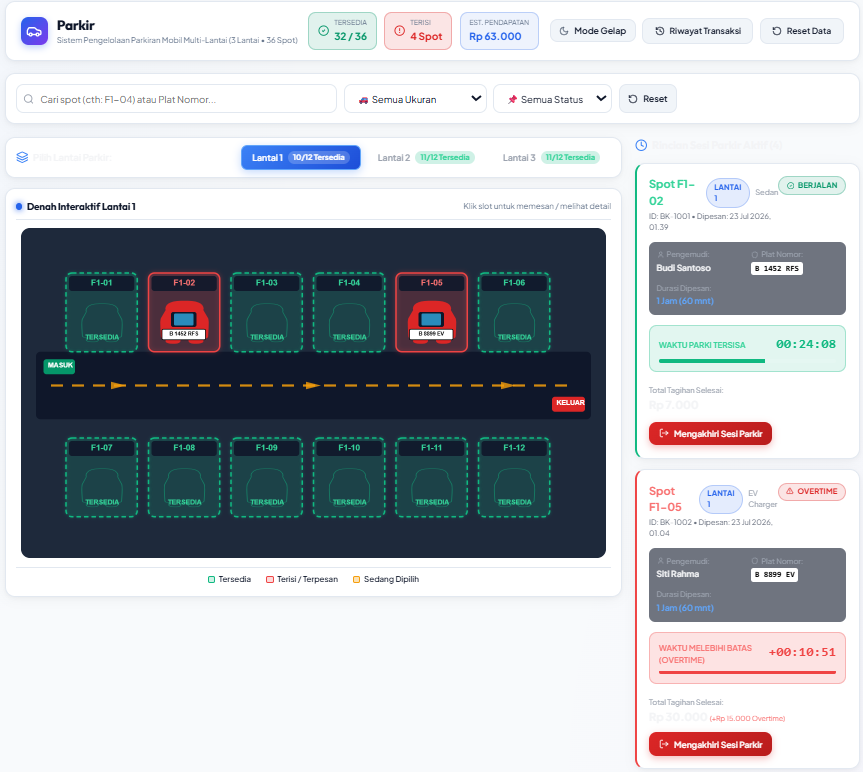

# 🚗 Parking Vision Pro - Sistem Pengelolaan Parkiran Multi-Lantai

Sistem pengelolaan tempat parkir interaktif dan modern berbasis **Next.js Pages Router**, **TypeScript**, dan **Konva.js Canvas**. Aplikasi ini dirancang untuk memantau, mendata, dan mengelola reservasi slot parkir secara real-time pada gedung parkir multi-lantai.

---

## 📷 Tampilan Aplikasi



---

## ✨ Fitur Utama

- 🏢 **Multi-Lantai Interaktif**: Visualisasi denah parkir interaktif 3 lantai (36 total spot) menggunakan **Konva Canvas**.
- 🔍 **Pencarian & Filter Pintar**: Filter tempat parkir berdasarkan kode spot, plat nomor kendaraan, nama pengemudi, status (tersedia/terisi), serta tipe kendaraan (Compact, Sedan, SUV, EV Charger).
- ⏱️ **Manajemen Sesi & Overtime**: Menampilkan durasi parkir berjalan, timer hitung mundur, kalkulasi otomatis biaya keterlambatan (overtime), dan total tagihan akhir.
- 📋 **Riwayat Transaksi**: Catatan transaksi parkir yang telah diselesaikan.
- 🌙 **Tema Terang & Gelap (Light / Dark Mode)**: Antarmuka modern dengan dukungan switch tema adaptif dan kontras tinggi.
- 💾 **Persebaran Data Lokal (LocalStorage)**: Menyimpan status spot dan riwayat transaksi secara aman di browser local storage.

---

## 🛠️ Teknologi yang Digunakan

- **Framework**: [Next.js](https://nextjs.org/) (Pages Router)
- **Library UI**: React 18 & TypeScript
- **Interactive Canvas**: Konva.js (`konva` & `react-konva`)
- **Icon Set**: Lucide React (`lucide-react`)
- **Styling**: Modern Vanilla CSS Variables (Glassmorphism design system)

---

## 🚀 Cara Menjalankan Project

### Prasyarat
- Node.js (versi 18.x atau lebih baru)
- npm

### 1. Install Dependensi
```bash
npm install
```

### 2. Jalankan Server Pengembang (Development Mode)
```bash
npm run dev
```
Buka [http://localhost:3000](http://localhost:3000) pada browser Anda.

### 3. Build untuk Produksi
```bash
npm run build
npm run start
```

---

## 📁 Struktur Folder Project

```
Parking-System/
├── public/                 # Asset publik (Gambar preview & favicon)
│   └── preview.png
├── pages/                  # Next.js Pages Router
│   ├── _app.tsx            # Custom App & Global Styling
│   ├── _document.tsx       # Custom HTML Document & Google Fonts
│   └── index.tsx           # Halaman Utama Dashboard Parkir
├── src/
│   ├── components/         # Komponen React (Navbar, ParkingCanvas, BookingModal, dll.)
│   ├── types/              # Definitions Tipe TypeScript
│   └── utils/              # Helper formatters & storage utilities
├── next.config.js          # Konfigurasi Next.js & Webpack
└── package.json            # Dependensi & skrip Next.js
```
